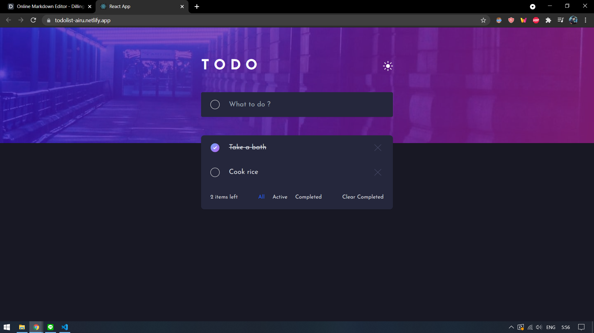

# Frontend Mentor - Todo app solution

This is a solution to the [Todo app challenge on Frontend Mentor](https://www.frontendmentor.io/challenges/todo-app-Su1_KokOW). Frontend Mentor challenges help you improve your coding skills by building realistic projects.

## Table of contents

- [Overview](#overview)
  - [The challenge](#the-challenge)
  - [Screenshot](#screenshot)
  - [Links](#links)
- [My process](#my-process)
  - [Built with](#built-with)
  - [What I learned](#what-i-learned)
  - [Continued development](#continued-development)
  - [Useful resources](#useful-resources)
- [Author](#author)
- [Acknowledgments](#acknowledgments)

## Overview

### The challenge

Users should be able to:

- View the optimal layout for the app depending on their device's screen size
- See hover states for all interactive elements on the page
- Add new todos to the list
- Mark todos as complete
- Delete todos from the list
- Filter by all/active/complete todos
- Clear all completed todos
- Toggle light and dark mode
- **Bonus**: Drag and drop to reorder items on the list

### Screenshot



### Links

- Live Site URL: **[To do List](https://todolist-airu.netlify.app/)**
- Solution URL: **[Front End Mentor Submission](https://www.frontendmentor.io/solutions/to-do-list-using-reactjs-and-tailwind-vLIeTpo3N)**

## My process

The background image which fill the width but have the constant heigt is challenging for me. And also the background image should change in dark/light mode and also when it comes to mobile. Here is my attempt.

```html
<div
  className="relative w-full h-screen bg-top bg-no-repeat bg-contain bg-bg-light dark:bg-bg-dark"
>
   /> />
</div>
```

So i change the opacity to adapt with dark/light mode and i hide and show it to adapt with responsive.

### Built with

- [React](https://reactjs.org/) - JS library
- [Tailwind](https://tailwindcss.com/)

### What I learned

- Dark and Light mode using context
- Set State
- How to update an array state
- Drag and Drop using React DnD
- Local Storage

### Continued development

I'm thinking to add this feature in my next development :

- Animation : for better UI

### Useful resources

- [How to Implement Dark Mode with Tailwind v2.0](https://braydoncoyer.dev/blog/how-to-implement-dark-mode-with-tailwind-2/)

## Author

- Website - [Airu](https://airu.netlify.app/)
- Linked In - [Rizky Khairullah](https://www.linkedin.com/in/airu/)
- Frontend Mentor - [@Rzkykhrllh](https://www.frontendmentor.io/profile/Rzkykhrllh)

**Airu**
Front end Developer
